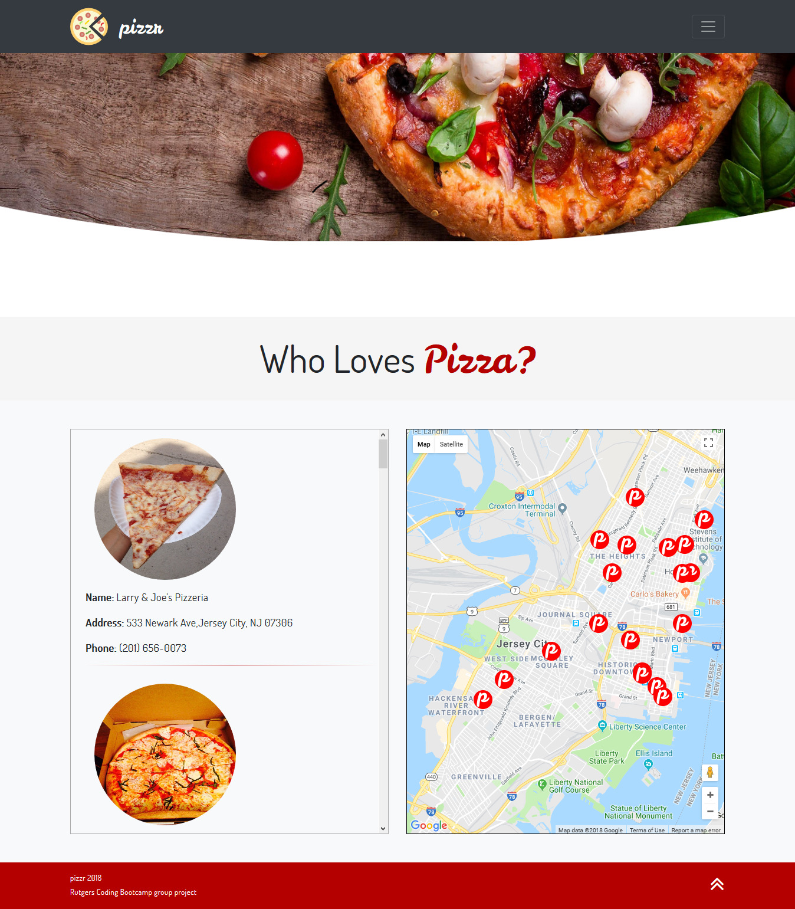

# PizzR 
Find your next best slice.

## Summary 
PizzR is a Pizza Finder app that uses Yelp API, Google Maps API, and IPInfo to locate the best slice of pizza near you.  The app uses IPInfo to ping your Latitude and Longitude using the IP address of your mobile device or computer. Yelp API is used to pull in ratings and restaurant information.  Google Maps API is used to show the location on the map.  We used a custom PizzR logo to show the pizzerias. 

## Screenshot

#### Jason Goncalves 2018

